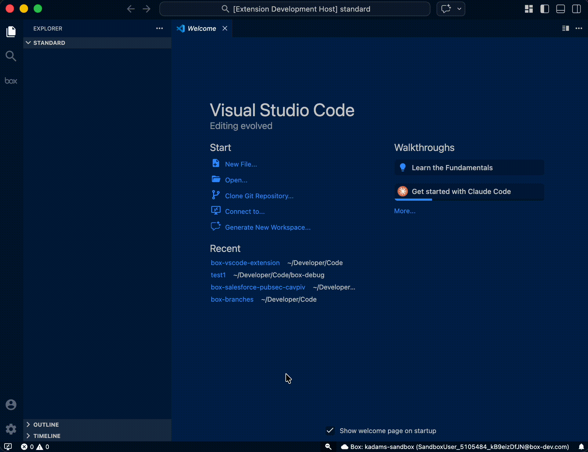

# Box Extension for Visual Studio Code

[](https://marketplace.visualstudio.com/items?itemName=box.box-vscode-extension)
[](https://code.visualstudio.com/)

A [Visual Studio Code](https://code.visualstudio.com/) extension that brings the power of the [Box](https://www.box.com/) content platform directly into your editor. Browse files, preview content, manage metadata templates and taxonomies, deploy configurations, and interact with Box UI Elements — all without leaving VS Code.

<!-- 🎬 TODO: Record an animated GIF showing the extension sidebar with the All Files tree view populated, expanding a few folders, and clicking a file to open the content preview. -->

## Quick Start

### Step 1: Install the Extension

Install the **Box** extension from the [VS Code Marketplace](https://marketplace.visualstudio.com/).

### Step 2: Create a Box Project

Open the Command Palette (`Cmd+Shift+P` / `Ctrl+Shift+P`) and run:

```
Box: Create Box Project
```

Choose a project template to scaffold your workspace:

| Template     | What's Included |
| ------------ | --------------- |
| **Blank**    | `box-project.json` only |
| **Standard** | `enterprise_configuration/`, `folders/`, `metadata-taxonomies/`, `metadata-templates/` |

This generates a `box-project.json` file that activates the extension automatically.

<p align="left">
  
</p>

<!-- 🎬 TODO: Record GIF showing the Command Palette → "Box: Create Box Project" → selecting a template → folder structure appearing in the explorer. -->

### Step 3: Authorize a Connection

Run from the Command Palette:

```
Box: Authorize Connection (OAuth 2.0)
```

The extension walks you through a multi-step wizard to collect your connection alias and credentials, then opens a browser window to complete the OAuth flow. Once authorized, your connection appears in the status bar.

<p align="left">
  
</p>

<!-- 🎬 TODO: Record GIF showing the authorize wizard steps (alias, client ID, secret, callback URL), browser OAuth redirect, and the status bar updating with the connection name. -->

### Step 4: Start Exploring

Click the **Box** icon in the activity bar to open the sidebar. Your files appear in the **All Files** tree view. Click any file to preview it.

---

## Features

### Browse Files and Folders

Navigate your entire Box file tree from the sidebar. The **All Files** view shows a paginated, hierarchical view of your folders and files with lazy loading and "Load More" support for large directories.

<p align="left">
  
</p>

<!-- 🎬 TODO: Record GIF expanding folders, scrolling through files, clicking "Load More", and using the filter feature. -->

**From the tree view you can:**

- **Create folders** — Inline or at root level
- **Delete items** — Remove files and folders with confirmation
- **Copy IDs** — Copy file or folder IDs to clipboard
- **Filter** — Search files by name across the tree
- **Refresh** — Refresh individual folders or the entire tree
- **Right-click** — Access context menu actions including Box UI Elements

### Preview Content

Click any file to open an interactive preview powered by [Box UI Elements](https://developer.box.com/guides/embed/ui-elements/). Supports **150+ file types** including documents, images, videos, audio, and more.

<p align="left">
  
</p>

<!-- 🎬 TODO: Record GIF clicking a file in the tree, the preview panel opening, scrolling through a document, toggling the details sidebar, and adding an annotation. -->

The preview includes:
- Document rendering with zoom and page navigation
- Annotations and drawing tools
- File details, versions, and access stats
- Activity feed with comments
- Box AI integration
- Secure downscoped tokens for each preview session

### Manage Metadata Templates

Browse, create, and edit enterprise and global metadata templates from the **Configuration** view in the sidebar.

<p align="left">
  
</p>

<!-- 🎬 TODO: Record GIF expanding the Configuration tree, clicking a metadata template, editing a field in the detail webview, adding a new enum field, and clicking Update. -->

- View all enterprise and global templates in a tree hierarchy
- Open a rich editor to add, edit, or remove template fields
- Supported field types: `string`, `float`, `date`, `enum`, `multiSelect`
- Manage enum and multiSelect options inline
- Toggle field flags like `hidden` and `copyInstanceOnItemCopy`
- Save template definitions as JSON to your workspace
- Copy template JSON to clipboard
- Create new templates or delete existing ones

### Manage Metadata Taxonomies

Browse, create, and manage metadata taxonomies and their hierarchical node structures.

<p align="left">
  
</p>

<!-- 🎬 TODO: Record GIF expanding a taxonomy in the Configuration tree, opening the taxonomy detail view, adding a level or node, and saving. -->

- View enterprise taxonomies with levels and nodes in a tree hierarchy
- Open a detail view to edit display names, add/remove levels, and manage nodes
- Parent-child node relationships
- Save taxonomy definitions as JSON
- Create new taxonomies or delete existing ones

### Deploy Metadata to Box

Right-click metadata template or taxonomy JSON files in the VS Code Explorer to deploy them directly to your Box enterprise.

<p align="left">
  
</p>

If the metadata template already exists, review the differences before deployment.

<p align="left">
  
</p>

<!-- 🎬 TODO: Record GIF right-clicking a JSON file in the explorer, selecting "Deploy to Default Box Enterprise", and showing the success notification. -->

- **Deploy to Default Enterprise** — Diff and deploy to your currently connected enterprise
- **Deploy to Target Enterprise** — Select any stored connection and diff and deploy to that enterprise
- Always previews a side-by-side diff of local vs. remote state before deploying
- Supports both creating new and updating existing templates/taxonomies
- Context-aware: automatically detects whether you're deploying metadata or files based on the folder
- Batch deployment with per-file progress notifications
- Available from explorer context menus and the command palette

### Metadata Query Builder

Build and execute metadata queries with an interactive form — no API calls needed.

<p align="left">
  
</p>

<!-- 🎬 TODO: Record GIF opening the query builder, selecting a template, adding query fields, executing the query, and switching between HTTP and UI Element result tabs. -->

- Template-aware field autocomplete
- **HTTP tab** — View raw JSON results with a filter input (always preserves `id` and `type` fields)
- **UI Element tab** — Render query results in the Box Content Explorer with metadata columns
- Copy request JSON to clipboard
- Paginated results with "Next Page" support

## Requirements

- [Node.js](https://nodejs.org/) 18+
- A Box account with a configured OAuth 2.0 application in the [Box Developer Console](https://app.box.com/developers/console)
- The OAuth 2.0 redirect URI in your Box app must match the extension's callback URL (default: `http://localhost:3000/callback`)

## Commands

All commands are available through the Command Palette (`Cmd+Shift+P` / `Ctrl+Shift+P`):

| Command | Description |
| ------- | ----------- |
| `Box: Create Box Project` | Scaffold a new Box project workspace |
| `Box: Authorize Connection (OAuth 2.0)` | Start the OAuth 2.0 authorization flow |
| `Box: Display All Box Connections` | List all stored connections |
| `Box: Display the Default Box Connection` | Show the current default connection |
| `Box: Set the Default Box Connection` | Change the default connection |
| `Box: Remove Box Connection` | Delete a stored connection |
| `Box: Get Access Token` | Refresh and copy the access token |
| `Box: Deploy to Default Box Enterprise` | Diff and deploy metadata or files to the default enterprise |
| `Box: Deploy to Target Box Enterprise` | Diff and deploy metadata or files to a selected enterprise |

## Requirements

- **VS Code** 1.109 or later
- A **Box account** with an [OAuth 2.0 Custom App](https://developer.box.com/guides/applications/custom-apps/) configured in the [Box Developer Console](https://app.box.com/developers/console)
- The OAuth 2.0 redirect URI in your Box app must match the callback URL entered during the authorization wizard (default: `http://localhost:3000/callback`)

## Build & Development

```bash
npm run compile        # TypeScript → out/
npm run watch          # Compile in watch mode
npm run lint           # ESLint on src/
npm run test           # Run tests (requires compile first)
npm run pretest        # compile + lint
```

To debug: open the project in VS Code and press **F5** to launch the Extension Development Host.

## Questions, Issues, and Feature Requests

- **Issues & Features**: [GitHub Issues](https://github.com/box/box-vscode-extension/issues)
- **Box Developer Docs**: [developer.box.com](https://developer.box.com/)
- **Box Community**: [Box Community Forum](https://community.box.com/)

## Release Notes

### 0.0.1

Initial release with project scaffolding, OAuth 2.0 connection management, file browsing, content preview, metadata template and taxonomy CRUD, deployment workflows, diff and deploy preview, Box UI Elements integration, metadata query builder, and developer app creation.

## License

This project is licensed under the MIT License. See the [LICENSE](LICENSE) file for details.
